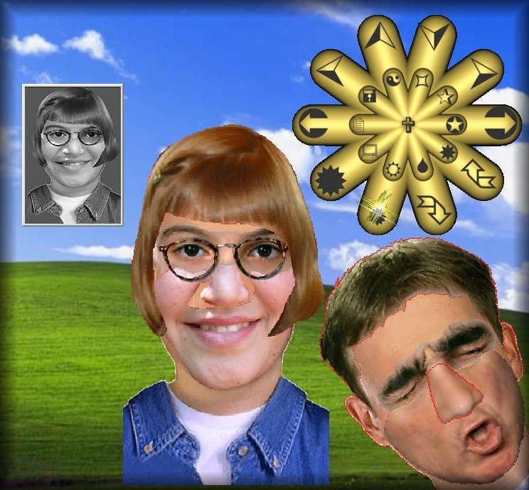



## Doctor Frankenstin Image Composer

### Description

it is a fun tool to make Faces and Caricatures. Requires Windows XP.
 
### More Info
 

             |
---                |---
**Submitted On**   |2005-12-16 15:59:04
**By**             |[Agustin Rodriguez](https://github.com/Planet-Source-Code/PSCIndex/blob/master/ByAuthor/agustin-rodriguez.md)
**Level**          |Intermediate
**User Rating**    |5.0 (25 globes from 5 users)
**Compatibility**  |VB 6\.0
**Category**       |[Complete Applications](https://github.com/Planet-Source-Code/PSCIndex/blob/master/ByCategory/complete-applications__1-27.md)
**World**          |[Visual Basic](https://github.com/Planet-Source-Code/PSCIndex/blob/master/ByWorld/visual-basic.md)
**Archive File**   |[Doctor\_Fra19571112162005\.zip](https://github.com/Planet-Source-Code/agustin-rodriguez-doctor-frankenstin-image-composer__1-63677/archive/master.zip)

